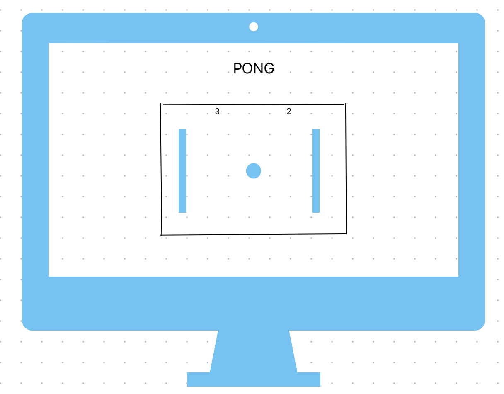

# PONG
##  I am sure that we all have played PONG before.
#### PONG is a game that was very popular before these console games came out. I remember playing PONG when I was 6 years old. 

#### I am bulding a game that should be fairly simple. There is gonna be two posts that will try to hit the ball before it goes off screen. 

#### if the ball goes off screen it's a point for the other player. First to __FIVE__ points wins the game. 

## MVP
* Have the opposing post go up and down at a consitant speed
* Have a winner box at the bottem
* Have a score counter 
* Have the ball move up in speed that makes sense; for example when someone gets to 4 points, have the ball going at a very fast speed
* Render a ball when someone scores a point
* Have a reset button for someone wins

## Stretch Goals
* Make levels of hardness
* Get the balls increse in numbers
* Find a way for two people play at the same time

## Tech Being Used
* Html/CSS
* JavaScript

## potential roadblocks
* finding a way to end the game after the score reaches 6
* getting the ball to render back into the game after someone scores
* getting the ball to go faster depanding on the score